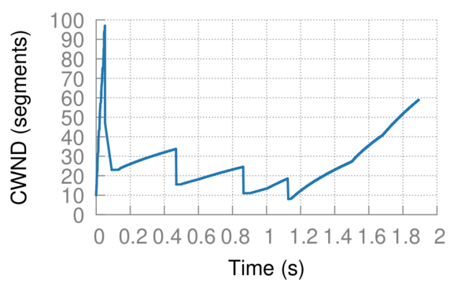

# Getting started

You can either immediately start with the tutorial below, or read more documentation:

* `basic_simulation_and_run_folder.md` -- Basic concepts
* `ptop_topology.md` -- Point-to-point topology
* `flows_application.md` -- Flow application ("send from A to B a flow of size X at time T")
* `utilization_tracking.md` -- Utilization tracking
* `pingmesh_application.md` -- Ping application ("send from A to B a ping at an interval I")
* `tcp_optimizer.md` -- Optimize certain TCP parameters
* `arbiter_routing.md` -- A new type of routing with more flexibility
* `future_work.md` -- To find out what can be extended / improved


## Tutorial

1. Create a directory anywhere called `example_run`, and create three files in there:

   **config_ns3.properties**
   
   ```
   simulation_end_time_ns=10000000000
   simulation_seed=123456789
   
   topology_filename="topology.properties"
   topology_link_data_rate_megabit_per_s=100.0
   topology_link_delay_ns=10000
   topology_link_max_queue_size_pkt=100
   topology_disable_traffic_control_endpoint_tors_xor_servers=true
   topology_disable_traffic_control_non_endpoint_switches=true
   
   enable_link_utilization_tracking=true
   link_utilization_tracking_interval_ns=100000000
   
   enable_flow_scheduler=true
   flow_schedule_filename="schedule.csv"
   enable_flow_logging_to_file_for_flow_ids=set(0,1,2,3,4)
   ```
   
   **topology.properties**
   
   ```
   # One ToR with 3 servers
   #
   #    0
   #  / | \
   # 1  2  3
   
   num_nodes=4
   num_undirected_edges=3
   switches=set(0)
   switches_which_are_tors=set(0)
   servers=set(1,2,3)
   undirected_edges=set(0-1,0-2,0-3)
   ```
   
   **schedule.csv**
   
   ```
   0,1,3,10000000,0,,
   1,2,3,7000000,10000,,
   2,3,1,300000,138953,,
   3,2,1,7800001,3738832,,
   4,2,1,7800001,3738832,,
   ```
   
2. Your folder structure should as such be:

   ```
   example_run
   |-- config_ns3.properties
   |-- topology.properties
   |-- schedule.csv
   ```

3. Into your ns-3 `scratch/` folder create a file named `main_flows.cc`

4. The following is an example code for `scratch/main_flows.cc`:

    ```c++
    #include <map>
    #include <iostream>
    #include <fstream>
    #include <string>
    #include <ctime>
    #include <iostream>
    #include <fstream>
    #include <sys/stat.h>
    #include <dirent.h>
    #include <unistd.h>
    #include <chrono>
    #include <stdexcept>
    #include "ns3/basic-simulation.h"
    #include "ns3/flow-scheduler.h"
    #include "ns3/topology-ptop.h"
    #include "ns3/tcp-optimizer.h"
    #include "ns3/arbiter-ecmp-helper.h"
    #include "ns3/ipv4-arbiter-routing-helper.h"
    #include "ns3/ptop-utilization-tracker-helper.h"
    
    using namespace ns3;
    
    int main(int argc, char *argv[]) {
    
        // No buffering of printf
        setbuf(stdout, nullptr);
        
        // Retrieve run directory
        CommandLine cmd;
        std::string run_dir = "";
        cmd.Usage("Usage: ./waf --run=\"main_flows --run_dir='<path/to/run/directory>'\"");
        cmd.AddValue("run_dir",  "Run directory", run_dir);
        cmd.Parse(argc, argv);
        if (run_dir.compare("") == 0) {
            printf("Usage: ./waf --run=\"main_flows --run_dir='<path/to/run/directory>'\"");
            return 0;
        }
    
        // Load basic simulation environment
        Ptr<BasicSimulation> basicSimulation = CreateObject<BasicSimulation>(run_dir);
    
        // Read point-to-point topology, and install routing arbiters
        Ptr<TopologyPtop> topology = CreateObject<TopologyPtop>(basicSimulation, Ipv4ArbiterRoutingHelper());
        ArbiterEcmpHelper::InstallArbiters(basicSimulation, topology);
    
        // Install utilization trackers
        PtopUtilizationTrackerHelper utilTrackerHelper = PtopUtilizationTrackerHelper(basicSimulation, topology);
    
        // Optimize TCP
        TcpOptimizer::OptimizeUsingWorstCaseRtt(basicSimulation, topology->GetWorstCaseRttEstimateNs());
    
        // Schedule flows
        FlowScheduler flowScheduler(basicSimulation, topology); // Requires flow_schedule_filename to be present in the configuration
    
        // Run simulation
        basicSimulation->Run();
    
        // Write result
        flowScheduler.WriteResults();
    
        // Write utilization result
        utilTrackerHelper.WriteResults();
    
        // Finalize the simulation
        basicSimulation->Finalize();
    
        return 0;
    
    }
    ```

5. Run it by executing in your ns-3 folder:

   ```
   ./waf --run="main_flows --run_dir='/your/path/to/example_run'"
   ```
   
   ... or if you also want to save the console output:
   
   ```
   mkdir -p /your/path/to/example_run/logs_ns3
   ./waf --run="main_flows --run_dir='/your/path/to/example_run'" 2>&1 | tee /your/path/to/example_run/logs_ns3/console.txt
   ```
   
6. Within `/your/path/to/example_run/logs_ns3` you should find the following output:

   ```
   logs_ns3
   |-- finished.txt
   |-- timing_results.txt
   |-- flows.txt
   |-- flows.csv
   |-- utilization.csv
   |-- utilization_compressed.{csv, txt}
   |-- utilization_summary.txt
   |-- flow_{0, 1, 2, 3}_{cwnd, progress, rtt}.csv
   ```
   
7. For example, `flows.txt` will contain:

   ```
   Flow ID     Source    Target    Size            Start time (ns)   End time (ns)     Duration        Sent            Progress     Avg. rate       Finished?     Metadata
   0           1         3         80.00 Mbit      0                 1008391170        1008.39 ms      80.00 Mbit      100.0%       79.3 Mbit/s     YES           
   1           2         3         56.00 Mbit      10000             1892039818        1892.03 ms      56.00 Mbit      100.0%       29.6 Mbit/s     YES           
   2           3         1         2.40 Mbit       138953            80843116          80.70 ms        2.40 Mbit       100.0%       29.7 Mbit/s     YES           
   3           2         1         62.40 Mbit      3738832           1615935742        1612.20 ms      62.40 Mbit      100.0%       38.7 Mbit/s     YES           
   4           2         1         62.40 Mbit      3738832           1683533740        1679.79 ms      62.40 Mbit      100.0%       37.1 Mbit/s     YES           
   ```

8. You could also plot a flow (e.g., flow 1):

   ```
   cd build/plot_helpers/flow_plot
   python flow_plot.py /path/to/example_run/logs_ns3 /path/to/example_run/logs_ns3/data /path/to/example_run/logs_ns3/pdf 1 10000000
   ```
   
   ... and then you can for example look at the congestion window of flow 1 over its runtime:
   
   **/path/to/example_run/logs_ns3/pdf/plot_tcp_time_vs_cwnd_1.pdf**
   
   [](images/tutorial_plot_tcp_time_vs_cwnd_1.pdf)
